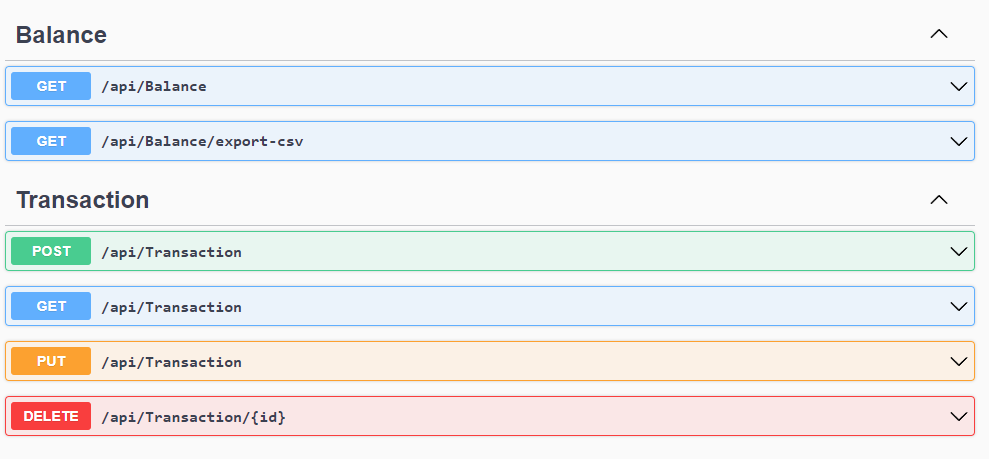

# Desafio Fluxo de Caixa

A aplicação foi feita em:

    * .NET 6
    * Postgres

## Como rodar?

Com o .NET 6 e o docker já instalado em máquina, rode o comando:

```[shell]
$: docker compose up -d
```


Após a inicialização do banco de dados, a aplicação pode ser iniciada:


## Features

    * Balance
    * Transactions



### Balance

Reponsável por dar o valor consolidado do caixa a partir de uma data. 

Exemplo de query filter:


As informações retornadas são:

    * IncomeInCents: Valor de entrada em centavos
    * OutcomeInCents: Valor de saída em centavos
    * BalanceInCents: Balanço em centavos
    * DateOfCashFlow: Dia do caixa


### Transaction

Reponsável por informar, criar, atualizar e deletar os detalhes de movimentações do caixa do dia.

